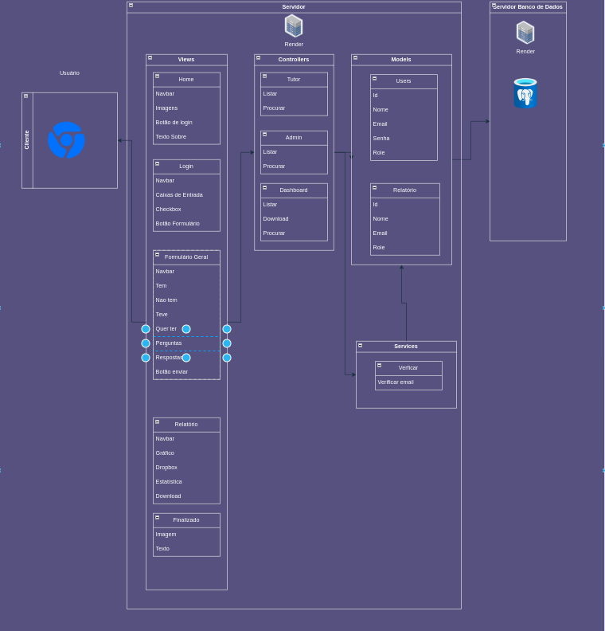
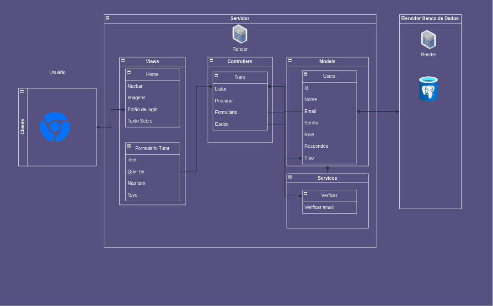
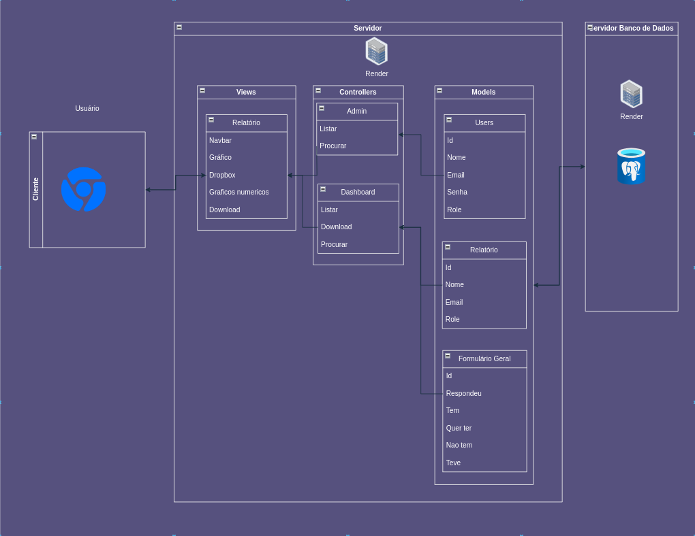
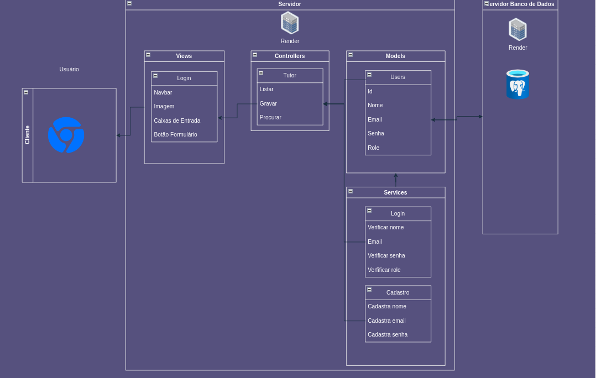

# MVC do Projeto Abandono 0

O projeto "Abandono 0" implementa a arquitetura MVC para promover uma organização clara do código, permitindo escalabilidade e manutenção eficientes. Abaixo, detalhamos cada parte da arquitetura, com descrições baseadas nos diagramas fornecidos.

## Visão Geral

MVC é um padrão de arquitetura de software que divide a aplicação em três camadas interconectadas:

- **Model**: Responsável pela manipulação dos dados e lógica de negócios.
- **View**: Interface do usuário onde as interações ocorrem.
- **Controller**: Orquestra as interações entre o Model e a View.

## Views

As Views representam a interface do usuário:

- **Tela Inicial**: A página de boas-vindas que apresenta o projeto e oferece opções de cadastro e login.
- **Tela de Cadastro/Login**: Onde os usuários podem criar uma nova conta ou acessar uma existente.
- **Formulários**: Várias páginas de formulários coletam dados dos usuários, adaptando-se ao seu perfil específico.
- **Relatório**: Para administradores, oferece a possibilidade de visualizar e interagir com dados coletados e analisados.

## Controllers

Os Controllers atuam como intermediários entre as Views e Models:

- **Users**: Controla o registro, autenticação e verifica se o usuário é administrador.
- **Pesquisador**: Gerencia a criação, filtragem e o download de relatórios.

## Models

Os Models gerenciam os dados e a lógica de negócios:

- **Users**: Armazena informações de cadastro e autenticação dos usuários.
- **Services**: Valida as informações de login e cadastro.
- **Tabela**: Mantém os dados submetidos através dos formulários.

## Interações

Cada View é conectada a um Controller específico, que por sua vez interage com os Models correspondentes:

- **Tela de Cadastro/Login**: Envia dados para o `Users Controller`, que utiliza o `Services Model` para validar e armazenar as informações.
- **Formulários**: Submetem dados para o `Controller`, que atualiza o `Tabela Model` com novas entradas.
- **Relatório**: O `Pesquisador Controller` acessa e manipula os dados no `Tabela Model` e gera relatórios.

Esta é a interface inicial que os usuários veem ao visitar o site. Inclui uma barra de navegação, imagens, um botão de login e um texto introdutório sobre o projeto. É uma view estática e serve como o ponto de partida para a navegação do usuário.

Tutor e Admin Controllers (mvc1.png e mvc2.png)
Estes controllers atendem a diferentes tipos de usuários: Tutor para os usuários regulares e Admin para os administradores do sistema. O Tutor Controller gerencia a listagem, busca, e interações com o formulário de tutor, enquanto o Admin Controller lida com operações administrativas no dashboard, como listar e procurar relatórios ou dados.

Dashboard e Relatório Views 
O Dashboard é a interface administrativa onde os relatórios e análises dos dados coletados são acessados e manipulados. A View Relatório permite que os administradores gerem, filtrem e baixem relatórios e visualizem gráficos e estatísticas.

Login e Formulário Tutor Views
Estas são as páginas onde os usuários podem entrar em suas contas e responder a questionários específicos. A tela de Login possui elementos de entrada para as credenciais do usuário, e o Formulário Tutor coleta informações sobre a experiência de ter ou desejar ter um pet.

Models (Todas as imagens)
Os Models Users, Relatório e Services armazenam os dados e as regras de negócio da aplicação. O Model Users contém informações do usuário, como ID, nome, e-mail e senha. Services oferece funcionalidades como verificação de e-mails, enquanto o Model Relatório armazena dados utilizados para gerar relatórios para os administradores.

## Fonte

Material produzido por Arthur Bretas Oliveira (2024)

